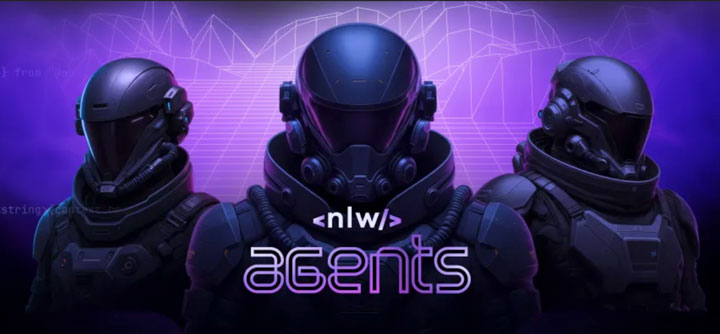

# Meta Assistant - AI for Gamers 🎮

**Ask about strategies, builds, and tips for your games!**

---

## 📄 About the Project

The **Meta Assistant** is an interactive web application developed as part of the **NLW Agents (Next Level Week #20)** event by **Rocketseat**.

NLW is a 100% online and free event from Rocketseat, focused on helping developers create complete projects from scratch and elevate their programming skills in just one week.

This project was born with the objective of demonstrating the integration of generative artificial intelligence into front-end applications, offering gamers a quick and intelligent tool to get information about strategies, team compositions, character builds, and tips for various games, such as Valorant and League of Legends.

<p align="center">
  
</p>

---

## ✨ Features

The Meta Assistant offers an interactive and direct experience for gamers:

* **Intuitive Interface:** A clean and easy-to-use design, allowing the user to enter their API key and ask questions quickly.
* **Generative AI Integration:** Utilizes the powerful Google Gemini API (`gemini-2.0-flash` model) to process your questions and generate intelligent and contextual answers about the gaming universe.
* **Dynamic Questions:** Ability to answer a wide range of questions, from agent compositions for specific maps in Valorant to strategies and builds in League of Legends.
* **Visual Feedback:** Clear responses displayed directly on the application interface.

---

## 🛠️ Technologies Used

* **Front-end:**
    * HTML5
    * CSS3
    * JavaScript (ES6+)
    * DOM (Document Object Model) Manipulation
* **AI API:**
    * Google Generative Language API (Gemini, `gemini-2.0-flash` model)
* **Hosting & Deployment:**
    * Vercel (for continuous deployment and hosting)
* **Version Control:**
    * Git
    * GitHub
* **Design/Assets:**
    * Adobe Photoshop (for creating and configuring thumbnails/assets)

---

## 🚧 Challenges Faced (and Overcome!)

This project, despite its straightforward functionality, presented significant challenges, especially during the integration and deployment phase:

* **Google Cloud API Key Configuration:** Managing API keys, including billing activation and setting up HTTP referrer restrictions, proved complex. The key worked perfectly in a local environment (`localhost`), but faced persistent rejections (`403 Forbidden`) in production environments.
* **Deployment and Compatibility Issues:** Initial deployment on static hosting platforms like GitHub Pages resulted in persistent `403 Forbidden` errors, even after correct referrer restriction configuration. This indicated an undocumented incompatibility or restriction from Google Cloud for that environment.
* **Cloud Support Bureaucracy:** The difficulty in obtaining direct technical support from Google Cloud while the account was in the free trial period added a significant layer of frustration to the troubleshooting process.
* **Overcoming and Resilience:** The ultimate solution involved migrating the deployment to the Vercel platform, which proved compatible with Google Cloud's security validations and allowed the API to function correctly in production. This process required considerable persistence in debugging and seeking alternative solutions.

---

## 🚀 How To Use

To interact with the Meta Assistant:

1.  **Get Your API Key:** Access the Google Cloud Console, navigate to "APIs & Services" > "Credentials," and create (or select) an API key for the Google Generative Language API.
    * **Important:** Configure HTTP referrer restrictions for `https://nlw-agents-dun.vercel.app/*` (and `http://localhost/*` if you plan to use it locally).
2.  **Access the Application:** Go to the [Online Meta Assistant](https://nlw-agents-dun.vercel.app/).
3.  **Enter the Key:** Paste your API key into the designated field on the application interface.
4.  **Ask Your Question:** Type your question into the text field and click "PERGUNTAR" (ASK).
5.  **Get the Answer:** The AI will process your request and display the answer directly on the screen!

---

## 🌐 Access the Online Project

The Meta Assistant is available and fully functional online via Vercel:

[**Access Online Meta Assistant**](https://nlw-agents-dun.vercel.app/)

---

## 💻 Local Installation

To run the project on your local machine for development or testing:

1.  **Clone the Repository:**
    ```bash
    git clone [https://github.com/andreskull2/nlw-agents.git](https://github.com/andreskull2/nlw-agents.git)
    ```
2.  **Navigate to the Directory:**
    ```bash
    cd nlw-agents
    ```
3.  **Open with Browser:** Simply open the `index.html` file in your preferred web browser (by dragging and dropping or using "Open with...").
4.  **API Key:** Remember to configure `http://localhost/*` in your Google Cloud Console API key referrer restrictions for it to work locally.

---

## ⚖️ License

This project is licensed under the MIT License. For more details, see the `LICENSE` file in the repository.

---

## 🙏 Credits and Acknowledgments

This project was developed as part of the **NLW Agents (Next Level Week #20)** event, a fantastic initiative by **Rocketseat** to empower developers.

Special thanks for the continuous assistance and resilience during the phase of overcoming technical and deployment challenges, which were crucial for the success of this online project.

---


